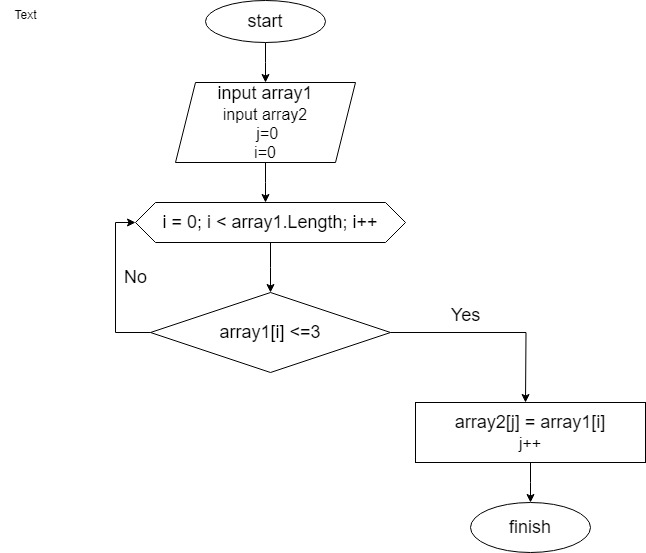

# Блок - схема решения задачи

## Описание алгоритма решения

Сначало объявляется два массива: изначальный и вторый такой же длины. Потом через цикл For, проверяем каждый i-тый элемент заданного массива на выполнение условия ( кол-во символов каждого i-го элемента меньше либо равно 3 ), если да элемент первого массива заносится в j элемент второго массива. Переменная j чтобы поочередно закидывать из первого массива во второй и чтобы потом не было пробелов. После присвоения увеличивается переменная j на 1 и возвращается к циклу for в котором i увеличивается на 1. И так проверяется до конца.

### Программа для решения задачи находится в папке FinalTask
